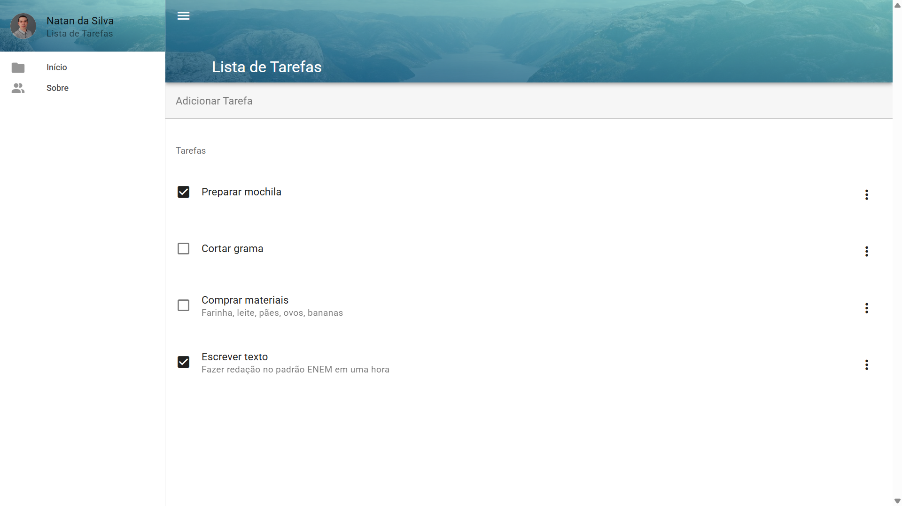
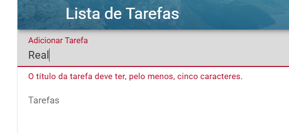
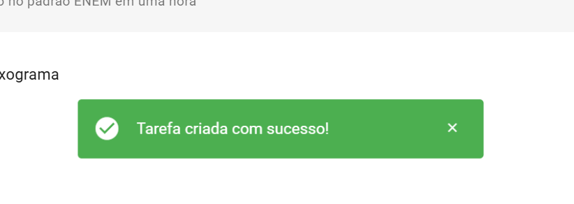
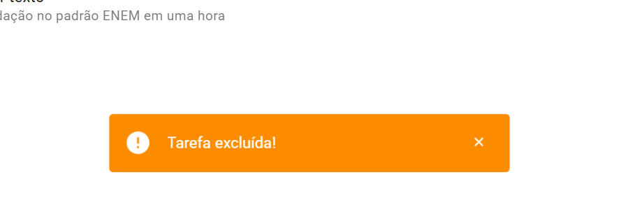
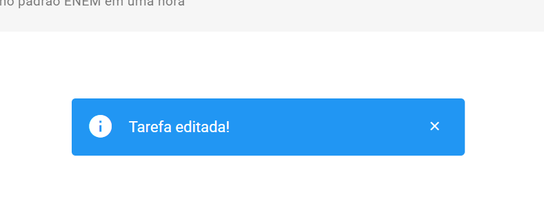
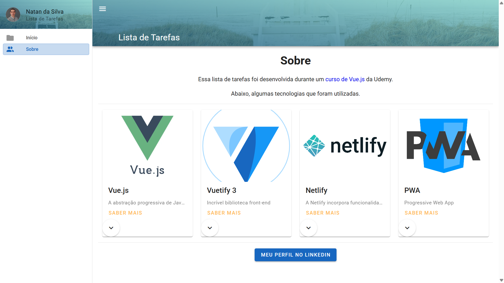

# Lista de Tarefas

[Acesse o projeto](https://lista-de-tarefas-com-vue.netlify.app/)

Projeto realizado durante o curso Curso completo Vue JS 3, Vuetify, Pinia, Vue Router e mais, da Udemy. Trata-se de um site de lista de tarefas. Para sua realização, usei Vue 3, Vuetify, Pinia e Netlify. O site armazena as tarefas do usuário no Local Storage. 

## O que se Encontra na Lista de Tarefas

* Tela Inicial
<table align="center">
  <tr>
    <td align="center">
       
      Nessa tela, o usuário vê, cria e conclui tarefas.
    </td>
  </tr>
</table>

* Validação da Entrada do Usuário
<table align="center">
  <tr>
    <td align="center">
       
      Validação ao se criar tarefa
    </td>
  </tr>
</table>

* Mensagens de Confirmação
<table align="center">
  <tr>
    <td align="center">
       
    </td>
  </tr>
  <tr>
    <td align="center">
       
    </td>
  </tr>
  <tr>
    <td align="center">
       
    </td>
  </tr>
</table>

* Página Sobre
<table align="center">
  <tr>
    <td align="center">
       
      A página apresenta as tecnologias usadas no projeto.
    </td>
  </tr>
</table>
